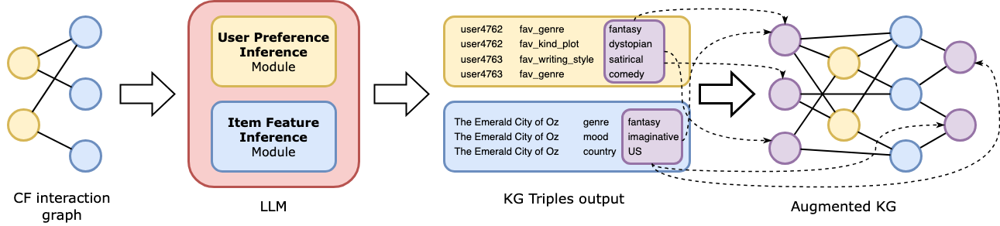
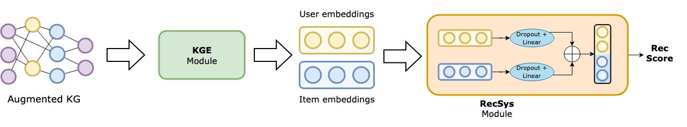

# GAL-KARS: Exploiting LLMs for Graph Augmentation in Knowledge-Aware Recommender Systems

### Repository for the paper 'GAL-KARS: Exploiting LLMs for Graph Augmentation in Knowledge-Aware Recommender System'





Our framework is composed of four main modules, as the image above shows.

The first two modules are implemented through LLMs, and share the same requirements; on the other hand, the KGE module and the RecSys module share the same requirements as well. For this reason, we provide 2 different `req` files.

First, we discuss the **installation** to run our code; then, we describe the **structure** of our repository; finally, we describe **how to run our code**.

### Installation

We suggest to use two different environments, as described above. We used python3.11 for our experiments.

```
# create the LLM env and activate it
virtualenv -p python3.11 llm_env
source llm_env/bin/activate

# install requirements
# torch version might vary based on your CUDA installation
pip install -r req_llm.txt
```

Similarly, we can create the env for the KGE and RecSys Module (we call it env_llm for short)
```
# create the KGE/RecSys env and activate it
virtualenv -p python3.11 llm_kge
source llm_kge/bin/activate

# install requirements
# torch version might vary based on your CUDA installation
pip install -r req_kge_recsys.txt
```

### Repo structure
We structured our repo as follows:

- `data` folder: contains the raw data for both the datasets; in particular: train set, test set, mapping items and entities with names, DBpedia KG, LLM KGs - both user and item; then, we have the 8 configurations considered in our experiments.

- `GAL-KARS` folder: the folder in which our framework is implemented; it is composed of source code to implement all the modules of GAL-KAR:
    - `infer_llm_data` is the folder that containes source code and data to infer triples by using the LLM; such folder is structured as follows,, for both the supported datasets (`ml1m` and `dbbook`):
        - `{dataset}_infer_user/item.py` is used to infer new triples for users/items in the dataset. These scripts require the files in the `in` subfolder, while results are stored in the `out` folder as json.
        - `process_user/item_triple.py` is used to convert the json files into set of triples, and build the KG_U and KG_I described in the paper.
        - such files are those named `LLM_user/item_triples.py`

    - `learn_emb` folder contains the source code and data to implement the KGE module and learn the embeddings; here, we put, for each dataset, all the 8 configurations we considered; moreover, in the `_embedding` folder, we put the embeddings we learnt
    - `recsys` folder contains the source code to run our RecSys module. 
        - In the `recsys/src/` you can find the source code of the recsys.
        - In `data/raw` we insert the raw data (train/test sets), while `data/embeddings` requires the embeddings learnt at the previous step (we avoided putting them again to save space).
        - `data/reports/` is the dicrectory destinated to the output files (recommendation lists and trained models)

- `baselines` contains the data and the script to run the hyperuning of the parameters of the baselines models (performed by [RecBole](https://recbole.io)); moreover, we added the data we used in our paper, formatted with RecBole format. For further details, we reference to the RecBole official documentation.

- `evaluation` contains the script to perform the evaluation with [ClayRS](https://swapuniba.github.io/ClayRS/); it evaluates both baselines and our approach performance. For further details, we reference to the ClayRS official documentation.

## Run GAL-KARS

### Step 1-2: Infer LLM item and user triples
To infer the LLM triples and build KG_U and KG_I, first, activate the corresponding environment.

Then, move to `1_infer_llm_data/{dataset}/` folder, and run `{dataset}_infer_user/item.py`; the reuslts will be stored in the `users/items` folders as json files.

Finally, process the results with `process_user/item_triple.py`.The resulting files will be named `LLM_user/item_triples.tsv`.

Here's an example of the usage, we use dbbook

```
# activate the environment
source env_llm/bin/activate

# run the inference
python dbbook_infer_item.py
python dbbook_infer_user.py

# process the results
python process_item_triples.py
python process_user_triples.py
```

### Step 3: KGE module
Once the triples have been inferred, they can be merged with the KG of DBpedia and the CF information. 

First, move to the `2_learn_embs` folder. 
Here, all the possible KGs configurations are reported in the `2_learn_embs/{dataset}/` folder, and are named accordingly (e.g., `8_cf_dbpedia_llm_ui` is the configuration in which we consider CF data + DBpedia + LLM triple item-side + LLM triples user-side). 

To learn the embeddings, activate the environment and run `learn_kge.py`; to gether such embeddings as `.pkl` files (required by the RecSys), run `get_embs.py`.

To speed up everything, we put in the `{dataset}/_embeddings` the post-processed embeddings used in our paper.

```
# activate the environment
source env_kge/bin/activate

# run the KG encoder
python learn_kge.py

# process the embeddings
python get_embs.py
```

Note that in the `learn_embs.py` you can set different parameters, including number of epochs, layer, embedding size, etc. We set those used in our experiments.

### Step 4: RecSys
Finally, to run our recommendation model, all you need to do is to copy the embeddings learnt at the previous step into the recys module, and run the script. 

To do so, move the embeddings in `3_recsys/data/embeddings/{dataset}/` folder; then, move to the `3_recsys` folder, and run `train_{dataset}.py`.

The recommendation lists will be saved in the `3_recsys/reports/{dataset}/predictions/` folder.

```
# activate the environment - it is the same of the KGE
source env_kge/bin/activate

# run the recsys
python src/train_dbbook.py
python src/train_ml1m.py
```

### Baselines

To run the baselines tuning, move to the `baselines` folder, install RecBole, and run the script `run_tuning.py`.

The trained model will be put in the `saved_{dataset}` folder; to get the recommendation lists, run `get_preds.py`.

```
# activate the environment and install recbole
# please refer to the recbole library for the requirements, as they might change in the future
virtualenv -p python3.11 env_recbole
source env_recbole/bin/activate

# run the tuning
python run_tuning.py

# get the preds
python get_preds.py
```

### Evaluation

To evaluate the recommendation lists obtained during the previous steps, move to the `evaluation` folder and install ClayRS; then, put all the prediction files in the corresponding folder (`recys` or `baselines`), and finally run `eval_{dataset}.py`.

```
# create a new env - refer to ClayRS doc
virtualenv -p python3.11 env_clayrs
source env_clayrs/bin/activate

# run the evaluation
python eval_dbbook.py
python eval_ml1m.py
```

ClayRS will produce out files containing the requested evaluations.
